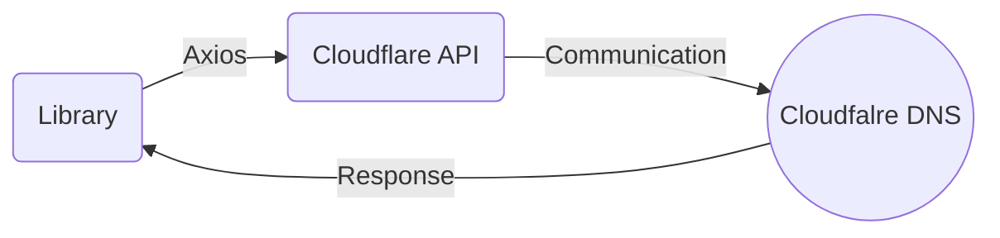

<center>

</center>


# CloudFlare-DNS-Manager

Easily automate and manage your **CloudFlare DNS** records with the **Node.js** and **Python3** CloudFlare DNS Manager library. This powerful tool allows developers to seamlessly interact with CloudFlare's DNS API, enabling automatic management of DNS records


## Installation
**NodeJS** required version **> 10.2.x**
```sh
npm install cloudflare-dns-manager@latest
```

## Example:
**NodeJS:**
```js
const CloudflareAPI = require('cloudflare-dns-manager');

// Replace 'your-email' and 'your-api-key' with your actual CloudFlare credentials
// แทน 'your-email' และ 'your-api-key' ด้วยข้อมูลบัญชี CloudFlare ของคุณ
const cfAPI = new CloudflareAPI('your-email@example.com', 'your-api-key');

// Replace 'your-zone-id' with the actual Zone ID you want to work with
// แทน 'your-zone-id' ด้วย Zone ID ที่คุณต้องการใช้งาน
const zoneId = 'your-zone-id';


(async () => {
	// Example: Add a new DNS record
	// ตัวอย่าง: เพิ่ม record DNS ใหม่
	const targetIp = '192.168.1.1';
	const recordName = 'example.com';
	const recordType = 'A';
	try {
	    const result = await cfAPI.addDnsRecord(targetIp, recordName, recordType, zoneId);
	    console.log(result);
	} catch (error) {
	    console.error(error);
	}
	
	// Example: Get the list of DNS records
	// ตัวอย่าง: ดึงรายการระเบียน DNS
	try {
	    const result = await cfAPI.dnsScan(zoneId);
	    console.log(result);
	} catch (error) {
	    console.error(error);
	}
	
	// Example: Update a DNS record
	// ตัวอย่าง: อัปเดท record DNS
	const updatedIp = '192.168.1.2';
	const recordIdToUpdate = 'record-id-to-update'; // Replace with the actual record ID
	try {
	    const result = await cfAPI.updateDnsRecord(updatedIp, recordName, recordType, zoneId, recordIdToUpdate);
	    console.log(result);
	    // If you want Data only. หากต้องการสำหรับข้อมูลเท่านั้น.
	    console.log(result.data);
	} catch (error) {
	    console.error(error);
	}
	
	// Example: Delete a DNS record
	// ตัวอย่าง: ลบ record DNS
	const recordIdToDelete = 'record-id-to-delete'; // Replace with the actual record ID
	try {
	    const result = await cfAPI.deleteDnsRecord(zoneId, recordIdToDelete);
	    console.log(result);
	} catch (error) {
	    console.error(error);
	}
})();


```
## FAQ
- **How to get cloudflare API** ?
[-> Read here <-](https://developers.cloudflare.com/fundamentals/api/get-started/create-token/)
- **Where do i get zoneId** ?
	1. Visit https://dash.cloudflare.com
	2. Select your **domain** .
	3. Then click **copy** here. 


## Class function infromation

**Usage for each function in the class.**

| Class Function | Args| Response json key |
|----------------|-------------------------------|-----------------------------|
|dnsScan|`zoneId`            |`success`, `exception`, `message`, `data `           |
|addDnsRecord          |`targetIp,  name,  recordType,  zoneId, comment, ttl`            |`success`, `exception`, `message`, `data`           |
|updateDnsRecord          |`targetIp,  name,  recordType,  zoneId, comment, ttl`            |`success`, `exception`, `message`, `data`           |
|deleteDnsRecord          |`zoneId,  recordId`|`success`, `exception`, `message`, `data`           |

## Inside


## Update
Python3 library is coming soon
